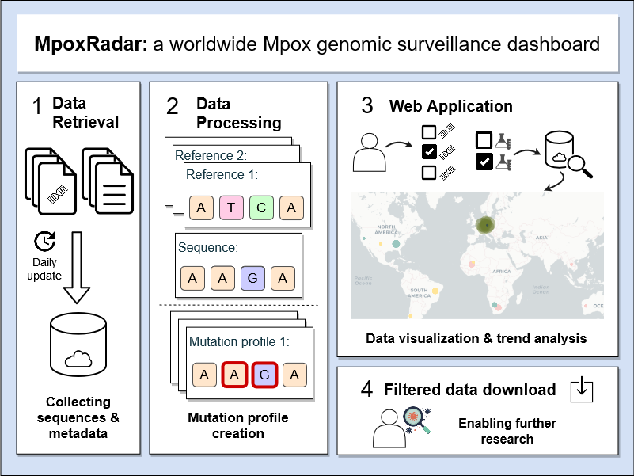

# MpoxRadar-frontend
MpoxRadar is a worldwide interactive dashboard for genomic surveillance of MPXV (MonkeyPox virus).



</div>

With this web server, we provide tools to explore and compare metadata from Mpox sequences available from our data sources. Furthermore, we provide an advanced tool for more detailed searches. The chosen data using our tools is visualised and presented in downloadable tables. As Mpox does not have one defined reference genome, we provide multiple reference genomes to choose between. All sample genomes are pre-processed, aligned to multiple reference genomes, followed by variant calling on our servers to enable quick analysis and searches for our users.


-------

# Installation (Debian/Ubuntu)

The MPoxRadar system requirements;
1. MariaDB
2. Redis
3. Python

## Prepare environment.

This guide, we assume you are using Ubuntu/Debian (Linux environment.)

0. Install all requried softwares
```sh
sudo apt update && sudo apt upgrade
sudo apt install mariadb-server mariadb-client
sudo apt-get install redis

```

1. Prepare MariaDB server
```sh
sudo mysql_secure_installation

```
⚠️ For more detail ["mysql_secure_installation"](https://mariadb.com/kb/en/mysql_secure_installation/).

(Optional) Create an account (non-root) with password authentication

2. Prepare MariaDB connector

```sh
# download installation file
wget https://r.mariadb.com/downloads/mariadb_repo_setup
chmod +x mariadb_repo_setup

# be aware of the mariadb version "mariadb-10.6.XX" that was installed on your machine.
# in our case  "10.6.10"
sudo ./mariadb_repo_setup --mariadb-server-version="mariadb-10.6.10"

# update and reinstall libs.
sudo apt update
sudo apt install libmariadb3 libmariadb-dev
```
please visit https://mariadb.com/docs/skysql/connect/programming-languages/c/install/#Installation_via_Package_Repository_(Linux) for more details.

3. Setup Redis server.

⚠️ please edit "/etc/redis/redis.conf" for your server configuration.

please visit https://redis.io/docs/getting-started/ for more details.

## Setup Application.

1. Clone this project
```sh
git clone https://github.com/rki-mf1/MpoxRadar
```

2. We use conda package manager (also work with [mamba](https://mamba.readthedocs.io/en/latest/installation.html)) to initiate python environment.
```sh
# prepare conda channels, if never run these before
conda config --add channels defaults
conda config --add channels bioconda
conda config --add channels conda-forge
conda config --set channel_priority strict

conda create -n mpxradar python=3.10 poetry fortran-compiler emboss=6.6.0
conda activate mpxradar
```

3. Next, we use [poetry](https://python-poetry.org/docs/basic-usage/) to install/manage dependencies of the project.
```sh
cd MPXRadar-frontend
poetry install
```

4. By default, the project expects the ".env" file and it must be located in the project root directory.
Please copy the template ".env.template" to ".env".
```sh
cp .env.template .env
```
The ".env" variables can then be set according to your environment.

## Start Application

Start redis server.
```sh
# Run
redis-server /etc/redis/redis.conf
# check redis-server
ps aux | grep redis-server
```

Start MariaDB server.
```sh
# Run
sudo /etc/init.d/mysql start
```

Right now we can start application by using below command.
```sh
python app.py
```

## Note

1. ⚠️Attention⚠️: These installation/run steps are for a straightforward setup to start the application; however, you should consider only some steps on the production server. The specifics of the setup process may vary depending on the software and the production environment. Following best practices and industry standards is essential to ensure a secure, reliable, and maintainable production environment. Please do not hesitate to contact us if you require support.❤️

2. ⚠️ Currently, we use the caching system to keep data for 23 hours. If the restarting application has been made after 23 hours, it will build the new cache for the next 23 hours. You can remove the cache via the Redis command and restart the web application if needed.
```sh
# login
redis-cli -n 1

# then remove all keys
FLUSHALL
```
----

## Contributors

This application is a result of a collaboration between Hasso Plattner Institute and Robert-Koch Institute.

## MpoxSonar as engine for backend.
The MPoxRadar use [MpoxSonar](https://github.com/rki-mf1/MpoxSonar) as the backend engine.

The tool intregated under `pages/libs` (Git subtree).

Check the "CONTRIBUTING.md".

## Contact/Get support
⚠️ The work is still ongoing 🏗️ ⚠️

If you have found any bugs or technical problems with the application, report them in the Issues repository.

For business inquiries or professional support requests 🍺,
please contact Prof. Dr. Bernhard Renard (bernhard.renard@hpi.de) or Dr. Stephan Fuchs (fuchsS@rki.de)
